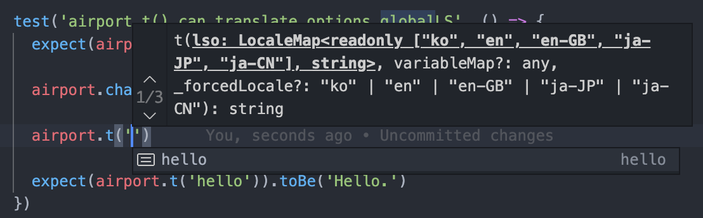
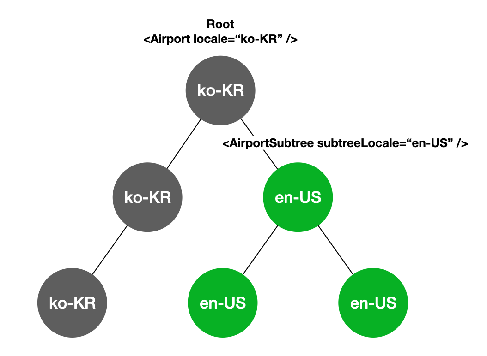

<p align="center">
  
</p>

# Features

<details><summary> TypeScript based module </summary>

`@airport` supports strong typings with Typescript.


Typing(Autocomplete) is supported for Global LS.

<br/>
</details>

<details><summary> React binding module support </summary>

By using `@airport/react`, you can use `Airport` made for React. `Airport` also includes `Subtree` feature that you can use to set separate locale to some part of the component tree.

<!--  -->

<br/>
</details>

<details><summary> Code splitting of language set </summary>

- Each message is saved in a format called LSO(Language Set Object) and grouped and used as LS(Language Set).
- Save messages in each file where they are used. Then messages will be Code splitted with related components.

```tsx
// Language Set (LS)
const LS = createLS({
  // Language Set Object (LSO)
  hello: {
    ko: '안녕하세요',
    ja: 'こんにちは。',
    en: 'Hello',
  },
  goodbye: {
    ko: '안녕히 가세요.',
    ja: 'さようなら。',
    en: 'Good bye',
  },
})

airport.t(LS.hello)
```

At the time of airport instantiation, you can pass a global LS that can be referenced anywhere in the project. If you use XLT, filtering can be done using LS format and provide it as an instance option.


```tsx
// Static Messages
const globalLS = createLS({
  home: {
    ko: '홈',
    ja: 'ホーム',
    en: 'Home',
  }
})

const airport = new Airport({
  // ...
  globalLS,
})

airport.t('hello')
```

<br/>
</details>

<details><summary> Number/DateTime/Currency format customization based on `Intl` </summary>

- Number/DateTime/Currency is formatted using `Intl`
- If you want to customize the format, it can be done manually instead of ICU(International Components for Unicode) or Unicode CLDR(Common Locale Data Repository)


```tsx
airport.fn(1000) // Number formatting with Intl

airport.fd(date) // Date formatting with Intl
airport.fd(date, 'YYYY-MM-DD') // Date formatting with custom format

airport.fc(99000) // Currency formatting. Customized format will be used if passed as an option at instantiation.
```

<br/>
</details>

<details><summary> DateTime handling and Timezone support </summary>

- Minimalist JavaScript library, dayjs is used to support Date/Time manipulation and Timezone.

```tsx
const now = airport.dayjs()
const after1hour = now.add(1, 'hour')

airport.fd(date) // Date formatting using timezone specified at the instantiation. Intl format is used
airport.fd(date, 'YYYY-MM-DD') // Date formatting using timezone specified at the instantiation. Custom format is used
airport.fd(date, 'YYYY-MM-DD', 'Asia/Seoul') // Date formatting using timezone passed as the argument. Custom format is used
```

<br/>
</details>

<details><summary> Currency conversion support </summary>

- If you set exchange rate and currency for each locale, currency exchange will be applied with relative format.


```tsx
const airport = new Airport({
  supportedLocales,
  locale: 'ko-KR',
  fallbackLocale: 'ko-KR',
  currency: {
    'ko-KR': Currency.KRW,
    'en-US': Currency.USD,
    'ja-JP': Currency.JPY,
  },
  keyCurrency: Currency.USD, // Standard currency. Default is USD
  exchangeRate: {
    [Currency.USD]: 1,
    [Currency.KRW]: 1135.50,
    [Currency.JPY]: 104.34,
  }
})

// Custom currency Yen is passed
const price = airport.fc(10000, Currenty.JPY) 
// Prints in current locale's currency
console.log(price) // "₩108,827" 
```

<br/>
</details>

<details><summary> VanillaJS support </summary>

You can use Airport without ReactJS. See `Installation > Use airport with vanillaJS`

<br/>
</details>

<br/>
<br/>

<!-- ------------ -->
<!-- INSTALLATION -->
<!-- ------------ -->

# Installation

<details><summary>Use airport with vanillaJS</summary>

### 1. Installation
```
npm install @airport/js
// or
yarn add @airport/js
```

### 2. Instantiate airport
```ts
const airport = new Airport({ 
  supportedLocales:['ko', 'en'],
  locale:"ko",
  fallbackLocale:"ko",
  currency :{
    ko: 'KRW',
    en: 'USD',
  },
  currencyFormat:{
    KRW: '{price}원',
    USD: '${price}',
  },
  currencyFormatValueKey:'price',
  exchangeRate:{
    USD: 1,
    KRW: 1000,
  },
  timezone:"Asia/Seoul"
})
```

<br/>
</details>

<details><summary>Use airport with ReactJS</summary>

### 1. Installation
```
npm install @airport/react
// or
yarn add @airport/react
```

### 2. Add Provider to Root Container
```tsx
import * as React from 'react'
import { AirportProvider } from '@airport/react'

import App from './App'

// Declare supportedLocales as const for Typescript typing
const supportedLocales = ['ko', 'ja', 'en'] as const

function Root() {
  return <AirportProvider
    supportedLocales={supportedLocales}
    locale="ko"
    fallbackLocale="ko"
  >
    <App />
  </AirportProvider>
}
```

### 3. use Airport through `useAirport`
```tsx
import * as React from 'react'
import { useAirport } from '@airport/react'

function App() {
  const { setLocale, t, fc, fnow } = useAirport()
  // ...
}
```

</details>

<br/>
<br/>

<!-- ------------ -->
<!--     API      -->
<!-- ------------ -->


# API
### `getOptions()`
Retrieves current airport instance's options.

**Arguments**
- none

**Returns**
- `(Option)`: current instance's option

```ts
const options = airport.getOptions()
```

<!-- -->
### `getLocale()`
Retrieves current locale.

**Arguments**
- none

**Returns**
- `(LocaleText)`: current locale in string

```ts
const locale = airport.getLocale()
```

<!-- -->
### `getLanguage()`
Retrieves current language.

**Arguments**
- none

**Returns**
- `(string)`: current language in string

```ts
const language = airport.getLanguage()
```

<!-- -->
### `getRegion()`
Retrieves current region.

**Arguments**
- none

**Returns**
- `(string)`: current region in string

```ts
const region = airport.getRegion()
```

<!-- -->
### `getDayjsLocaleName()`
Retrieves current locale suited for dayjs format.
locale is converted to lowercase (ex: `en-GB` -> `en-gb`)

**Arguments**
- none

**Returns**
- `(string)`: current locale in string lowercase

```ts
const dayjsLocaleName = airport.getDayjsLocaleName()
```

<!-- -->
### `getTimezone()`
Retrieves current timezone.

**Arguments**
- none

**Returns**
- `(Timezone | string)`: current timezone in string

```ts
const timezone = airport.getTimezone()
```

<!-- -->
### `changeLocale(locale: LocaleText)`
Change locale to desired locale.

**Arguments**
- `locale(LocaleText)`: Any entry in `supportedLocales` to change locale to.

**Returns**
- none

```ts
const newLocale = `ko`
airport.changeLocale(newLocale)
```

<!-- -->
### `changeTimezone(timezone: Timezone | string)`
change timezone to desired timezone.

**Arguments**
- `timezone(Timezone | string)`: any `Timezone` or timezone string to change timezone to.

**Returns**
- none

```ts
const newTimezone = 'Asia/Tokyo'
airport.changeTimezone(newTimezone)
```

<!-- -->
### `t(ls, variableMap?: Record<any,any>, _forcedLocale?: LocaleText)`
Function that selects appropriate text from language set according to current locale. Dynamic values can be applied by passing `variableMap` as a second parameter.

**Arguments**
- `ls` can be any of the types below:
  - `lso(LSO)`: Language Set Object(LSO) that has values for all supported locales.
  - `partialLso(PartialLSO)`: Language Set Object that has values for at least 1 supported locales.
  - `globalLSKey(keyof G)`: key of global Langauge Set Object.
- `variableMap(Record<any,any>)`(optional): Key-value object that has values to substitute from text.
- `_forcedLocale(LocaleText)`(optional): locale to apply instead of current airport instance's locale.

**Returns**
- `(string)`: Current locale's text from `ls`. Returns `''` if current locale entry doesn't exist in `ls`.

```ts
// lso
const createLS = createLSFactory<LocaleType>()
const LS = createLS({
  helloFull: {
    ko: '안녕하세요',
    en: 'Hello',
  },
})
console.log(airport.t(LS.helloFull))

// partialLSO
export const createPartialLS = createLSFactory<LocaleType, false>()
const PartialLS = createPartialLS({
  helloPartial: {
    en: 'Hello',
  }
})
console.log(airport.t(LS.helloPartial))

// globalLSKey
// Assume that airport has been initialized with global LSO that has 'hello' entry.
console.log(airport.t('hello')) 

// dynamic variable
export const createPartialLS = createLSFactory<LocaleType, false>()
const dynamicVarLS = createPartialLS({
  hello: {
    en: 'Hello, {name}',
  }
})
console.log(airport.t(dynamicVarLS.hello, { name: 'Jun' }))

// forced locale
export const createLS = createLSFactory<LocaleType>()
const LS = createLS({
  hello: {
    ko: '안녕하세요',
    en: 'Hello',
  }
})
console.log(airport.t(LS.hello, undefined, 'ko'))
```

<!-- -->
### `fnow(format: string, timezone?: TimezoneType, _forcedLocale?: T[number])`
Returns datetime string with desired format of now.

**Arguments**
- `format(string)`: Dayjs format string.
- `timezone(Timezone | string)`(optional): custom timezone to apply instead of current timezone.
- `_forcedLocale(LocaleText)`(optional): custom locale to apply instead of current locale.

**Returns**
- `(string)`: formatted datetime string of now

```ts
console.log(airport.fnow('YYYY-MM-DDTHH:mm:ssZ'))
```


<!-- -->
### `fd(datetime: Datetime, format?: string, timezone?: TimezoneType, _forcedLocale?: T[number])`
Returns datetime string with desired format of datetime argument.
If format is not specified, `Intl.DateTimeFormat` is used.

**Arguments**
- `datetime(string | number | Date | dayjs.Dayjs)`: datetime to format.
- `format(string)`(optional): Dayjs format string.
- `timezone(Timezone | string)`(optional): custom timezone to apply instead of current timezone.
- `_forcedLocale(LocaleText)`(optional): custom locale to apply instead of current locale.

**Returns**
- `(string)`: formatted datetime string of `datetime` argument

```ts
console.log(airport.fd(new Date(),'YYYY/MM/DD'))
```


<!-- -->
### `fn(value: number, options?: ImprovedNumberFormatOptions, _forcedLocale?: T[number])`
Formats given number value appropriate to current locale

**Arguments**
- `value(number)`: number to format
- `options(ImprovedNumberFormatOptions)`(optional): options for format with extra options added from `Intl.NumberFormatOptions`
- `_forcedLocale(LocaleText)`(optional): custom locale to apply instead of current locale.

**Returns**
- `(string)`: formatted number in current locale's number format.

```ts
console.log(airport.fn(10000))
```


<!-- -->
### `fc(value: number, customFormat?: string, baseCurrency?: Currency, isFixedCurrency = false, _forcedLocale?: T[number])`
Formats given number to current locale's currency.
(Uses `Option.currencyMap`, `Option.currencyFormatValueKey`,`Option.currencyFormat`)

**Arguments**
- `value(number)`: number to format as currency.
- `customFormat(string)`(optional): custom format to apply instead of `Option.currencyFormat`.
- `baseCurrency(Currency)`(optional): currency of `value`. `baseCurrency` is required if `isFixedCurrency` is `true`. 
- `isFixedCurrency(boolean)`(optional): if `isFixedCurrency` is true, `value` will not be exchanged and formatted to current locale's currency. 
- `_forcedLocale(LocaleText)`(optional): custom locale to apply instead of current locale.

**Returns**
- `(string)`: formatted number in current locale's currency.

```ts
// Assume that airport has been constructed with following option:
// 
// locale: 'ko-KR',
// currency: {
//   'ko-KR': 'KRW',
//   'en-US': 'USD',
// },
// currencyFormat: {
//   'USD': 'USD {v}',
//   'KRW': 'KRW {v},  
// },
// keyCurrency: Currency.USD,
// exchangeRate: {
//   [Currency.USD]: 1,
//   [Currency.KRW]: 1000,
// }

// KRW 10,000
console.log(airport.fc(10000)) 
// KRW 10,000,000
console.log(airport.fc(10000, undefined, USD))
// USD 10,000
console.log(airport.fc(10000, undefined, USD, true)) 
```


<!-- -->
### `dayjs(date?: dayjs.ConfigType): dayjs.Dayjs`
- `dayjs(date?: dayjs.ConfigType): dayjs.Dayjs`
- `dayjs(date?: dayjs.ConfigType, _forcedLocale?: T[number]): dayjs.Dayjs`
- `dayjs(date?: dayjs.ConfigType, format?: dayjs.OptionType, strict?: boolean, _forcedLocale?: T[number]): dayjs.Dayjs`
- `dayjs(date?: dayjs.ConfigType, format?: dayjs.OptionType, locale?: string, strict?: boolean, _forcedLocale?: T[number]): dayjs.Dayjs`

Returns `dayjs` object with current locale and timezone.
Same as `dayjs` signature, but with extra argument, `_forcedLocale`.

**Arguments**
- `date(dayjs.ConfigType)`: Same as first argument of dayjs. Supports `Date`, `string`, `dayjs.Dayjs` and more.
- `format(dayjs.OptionType)`(optional): Same as dayjs format string.
- `strict(boolean)`(optional): 
- `locale(string)`(optional): custom locale to apply instead of current locale.
- `_forcedLocale(LocaleText)`(optional): custom locale to apply instead of current locale.
  - **Warning: In 4th signature, `locale` is used instead of `_forcedLocale`**

**Returns**
- `(dayjs.Dayjs)`


<!-- ------------ -->
<!--     Types    -->
<!-- ------------ -->


# Types
> Type `LocaleText` in the guide is equivalent to `T[number]`(`string`) in the source code.

### Options
```tsx
interface Options<T extends ReadonlyArray<string>, G extends LS<T> = {}> {
  supportedLocales: T
  locale: T[number]
  fallbackLocale: T[number]
  name?: string
  globalLS?: G
  currency?: LocaleMap<T, CurrencyType>
  currencyFormatValueKey?: string
  currencyFormat?: CurrencyMap<string>
  keyCurrency?: CurrencyType
  exchangeRate?: CurrencyMap<number>
  timezone?: TimezoneType
  timezoneData?: TimezoneDataMap
  localTimezoneOnly?: boolean
}
```

### ImprovedNumberFormatOptions
```tsx
interface ImprovedNumberFormatOptions extends Intl.NumberFormatOptions {
  roundingMode?: RoundingMode // 'ceil' | 'floor' | 'round'
}
```

### LocaleMap
```tsx
type LocaleMap<T extends ReadonlyArray<string>, V> = {
  [locale in T[number]]: V
}
```

### CurrencyMap
```ts
type CurrencyMap<T> = {
  [currency in CurrencyType]?: T
}
```

### TimezoneDataMap
```ts
type TimezoneDataMap = {
  [timezone in TimezoneType]: TimezoneData | number
}
```


<!-- 
# Contribute
1. `git clone`
2. `yarn` or `npm install`
3. `npx lerna bootstrap`
4. Improve codes.
5. `yarn release` (It includes build and tests)
6. Before Input new version, commit build result first.
7. Input new version.
8. Release.

You must have your naver registry auth metadata on the ~/.npmrc.
-->

# License
```
Airport
Copyright 2024-present NAVER Corp.

Permission is hereby granted, free of charge, to any person obtaining a copy
of this software and associated documentation files (the "Software"), to deal
in the Software without restriction, including without limitation the rights
to use, copy, modify, merge, publish, distribute, sublicense, and/or sell
copies of the Software, and to permit persons to whom the Software is
furnished to do so, subject to the following conditions:

The above copyright notice and this permission notice shall be included in all
copies or substantial portions of the Software.

THE SOFTWARE IS PROVIDED "AS IS", WITHOUT WARRANTY OF ANY KIND, EXPRESS OR
IMPLIED, INCLUDING BUT NOT LIMITED TO THE WARRANTIES OF MERCHANTABILITY,
FITNESS FOR A PARTICULAR PURPOSE AND NONINFRINGEMENT. IN NO EVENT SHALL THE
AUTHORS OR COPYRIGHT HOLDERS BE LIABLE FOR ANY CLAIM, DAMAGES OR OTHER
LIABILITY, WHETHER IN AN ACTION OF CONTRACT, TORT OR OTHERWISE, ARISING FROM,
OUT OF OR IN CONNECTION WITH THE SOFTWARE OR THE USE OR OTHER DEALINGS IN THE
SOFTWARE.
```
