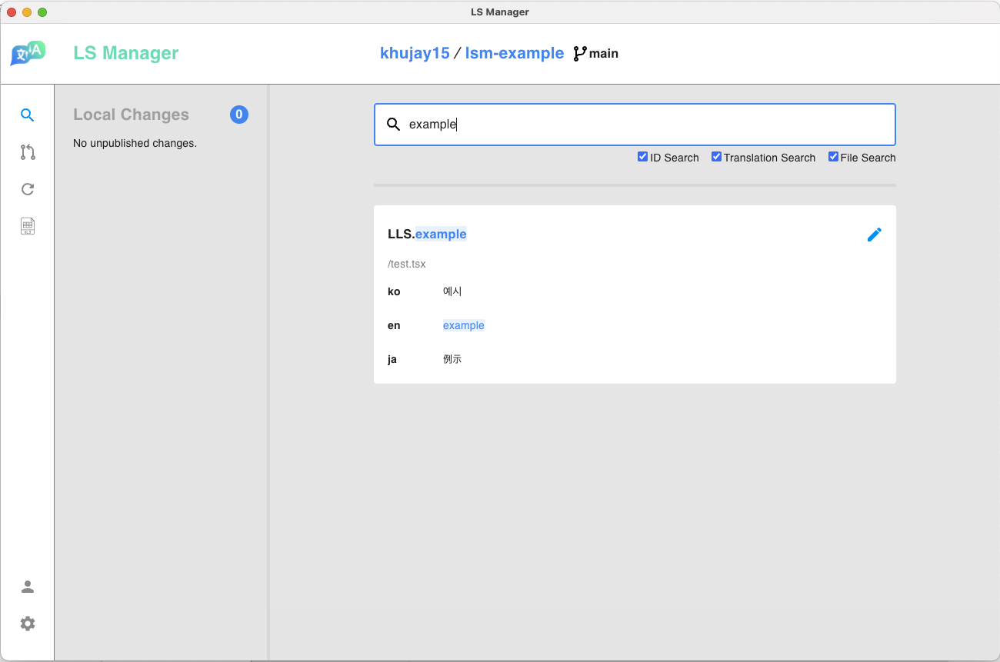
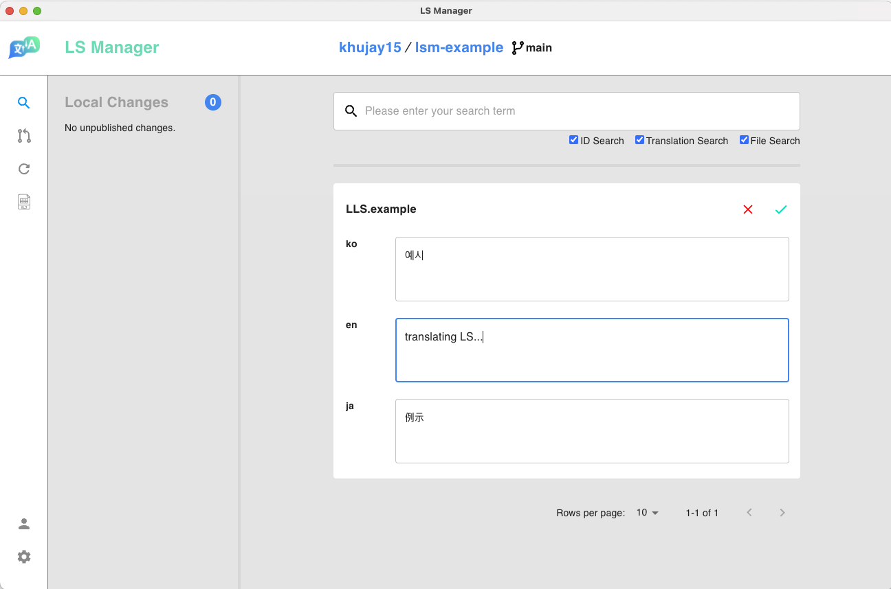
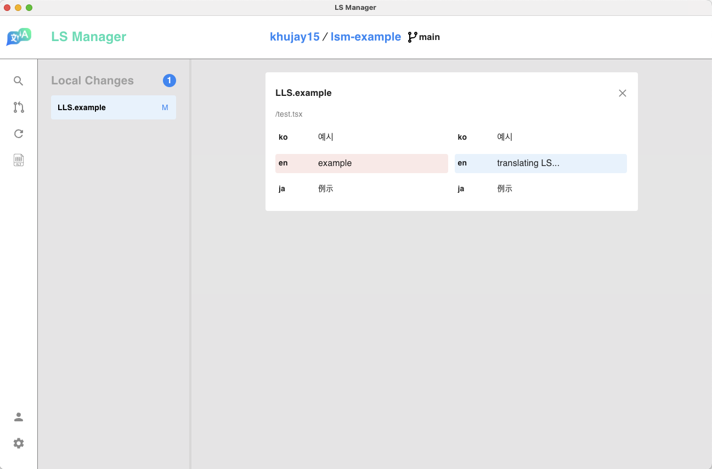
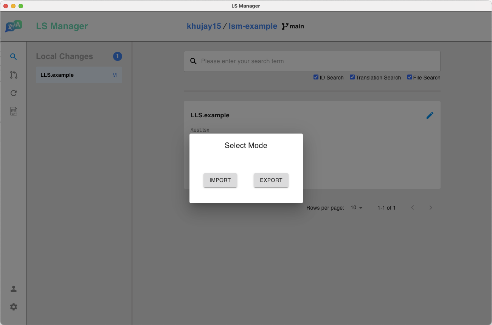
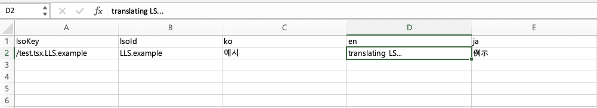

### Single Editing

Find the LS you want to modify, click the pen button at the top right to edit, and apply modifications by clicking on the check mark.

You can check modified items by clicking on the LS id in `Local Changes` in the left partition.

### Bulk editing

Click on the Excel file icon in the sidebar to select mode and select `EXPORT`.

You can export LS of the current project in xlsx or json file format by clicking the `EXPORT` button.

> Exported xlsx file

Make desired changes using applications of your favor(ex: Microsoft Excel) and import edited file by clicking the same Excel file icon and `IMPORT`
