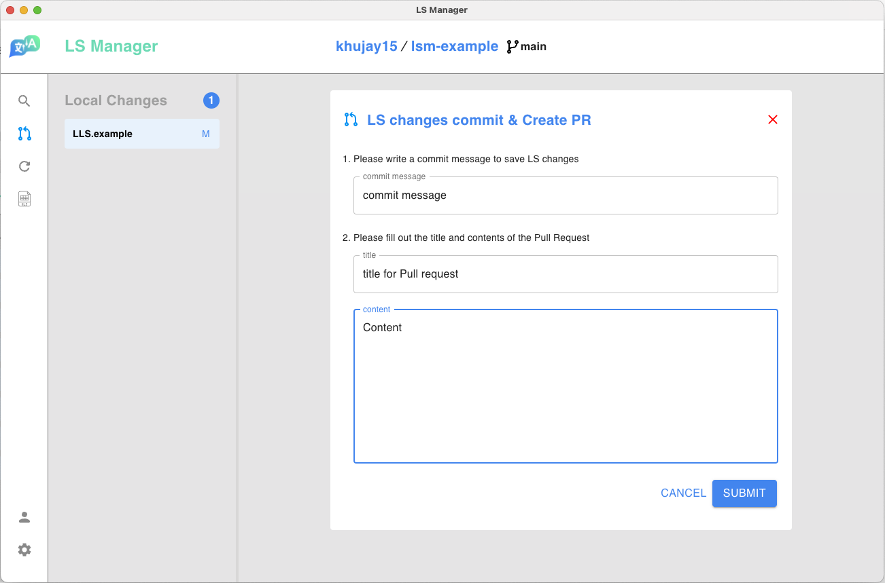
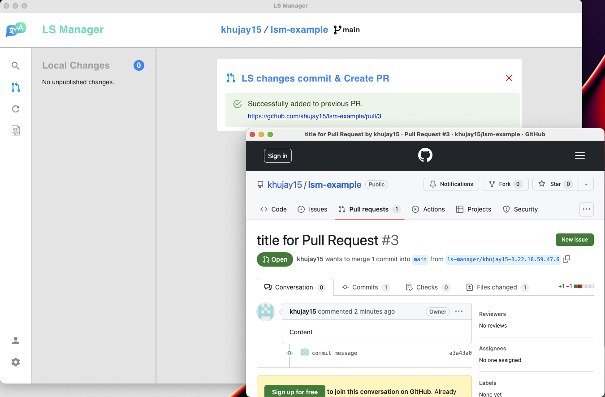
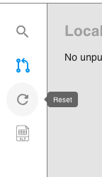
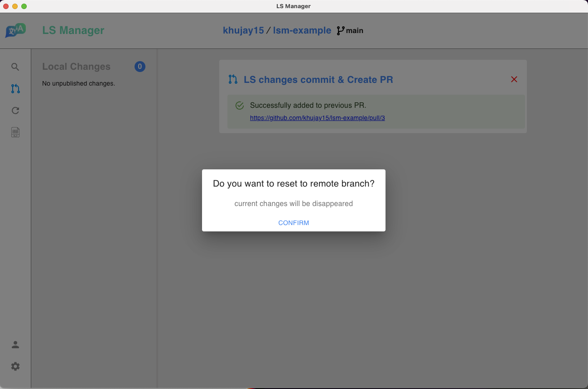

Click on the Pull Request icon on the left and fill in the form.

After filling the form, click the `Submit` button to create a Pull Request. (If you have not merged previous PR, new changes will be pushed to the same branch)

> We recommend to integrate CI to detect possible errors

Once the Pull Request has been merged, you can click on the left refresh icon to fetch the latest version of the target branch.

>Refresh(Reset) button fetches lastest LS of target branch

