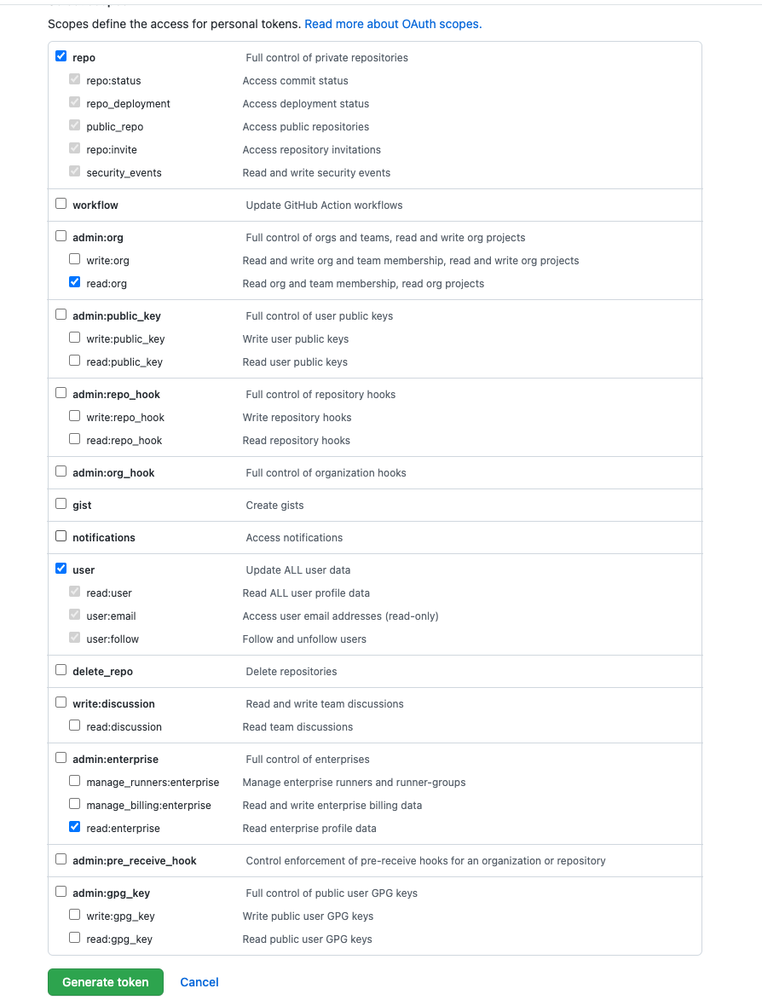
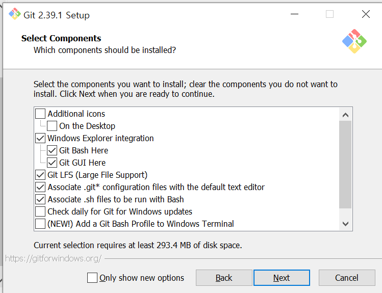

### Personal access token

1. Go to [Github(Personal access tokens (classic))](https://github.com/settings/tokens) and click on `Generate new token`.

2. Enter a name and expiration then check **repo**, **admin:org(read:org)**, **user**, **admin:enterprise(read:enterprise)** and generate the token.

   

3. Copy and save generated token somewhere to use to log in.

### Git for Windows (Windows)

For Windows, you need to install [Git for Windows](https://gitforwindows.org)

