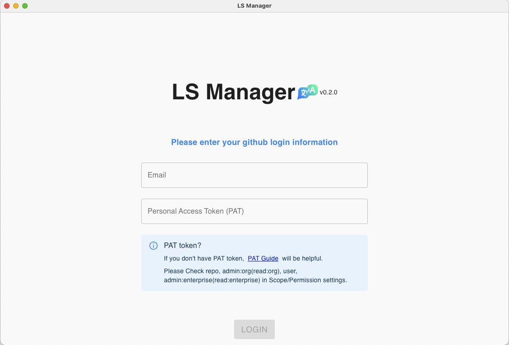
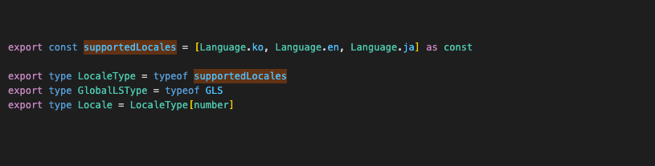
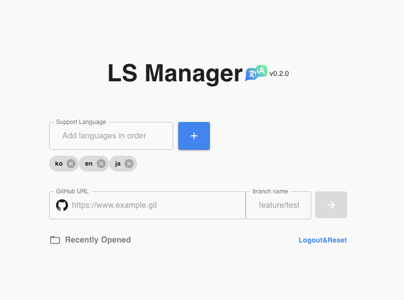

### 1. Login

Enter your GitHub account email and [PAT token](/docs/LS-Manager/Prerequisites).

### 2. Repository Configuration

Enter git repository url, working branch, and airport configuration value (`supportedLocales`).  
It is recommended to match the order of inputting Supported Languages with the project.

> Working branch refers to the branch that will be the base branch to be checked out from.

 

